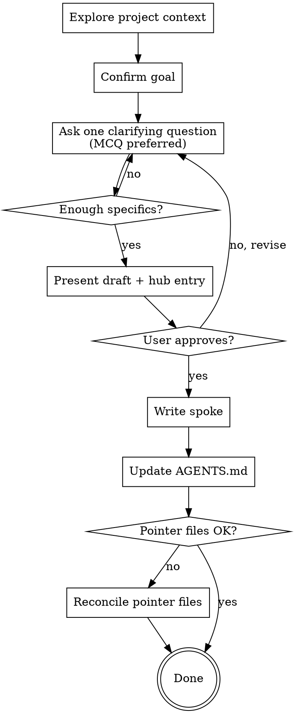

# Buckle

Help the user build and extend a Hub-and-Spoke agent documentation system through clarifying-question dialogue. The hub is `AGENTS.md` at the repo root — a table of contents. Spokes are any markdown files the hub points at: docs, agent instructions, runbooks, ADRs, whatever the user needs.

<HARD-GATE>
Do NOT write or modify any file until the user has approved both the spoke draft and the AGENTS.md routing entry. This applies even when the user's request seems fully specified — they may not have realized the request had ambiguity until they see your draft.
</HARD-GATE>

## The architecture

- **Hub** — `AGENTS.md` at the repo root. A table of contents that routes agents to spokes. Each entry says *when* an agent should read *which* file. Keep it short; if it grows long, push content out to a spoke and leave a one-line entry behind.
- **Spokes** — Any markdown files in the repo. Doesn't matter what kind: agent instructions, ADRs, runbooks, prose docs. The hub treats them uniformly.
- **Pointer files** — Tool-specific files like `CLAUDE.md`, `.cursorrules`, `.windsurfrules`, `.clinerules`, `.github/copilot-instructions.md`, `GEMINI.md`. When present, they MUST contain only:

  ```
  Read AGENTS.md for all instructions.
  ```

  Nothing else. The whole deduplication win depends on this — if rules live in three tool-specific files they will silently disagree.

## Checklist

Create a TodoWrite todo for each item and complete them in order:

1. **Explore project context** — check whether `AGENTS.md` exists, what pointer files exist, their contents, and the rough folder layout
2. **Confirm the goal** — what spoke does the user want to add, or what existing state do they want to restructure?
3. **Ask clarifying questions, one at a time** — extract specifics (file paths, version numbers, what NOT to do); prefer multiple-choice over open-ended
4. **Present the spoke draft + hub entry for approval** — show both exactly as they will be written; do not write yet
5. **Write the spoke** at the agreed path
6. **Update `AGENTS.md`** — add the routing entry; create `AGENTS.md` if it didn't exist
7. **Reconcile pointer files** — if any have inline content, offer to migrate it into a spoke first, then rewrite the pointer file as one line; if a pointer file is missing and the user uses that tool, offer to create it

## Process flow



## How to ask questions

- **One question per message.** Stacking questions makes users skim — they pick the easiest one and skip the rest. This is the single most important interview rule.
- **Multiple choice preferred.** Faster for the user and forces concrete options. Open-ended is fine when no obvious choices fit, but lean MCQ.
- **Push back on generics.** If the user says "just use standard React," follow up with a specific: "Are we enforcing Server Components by default? What's the rule for client-side state — Zustand, Context, something else?" Lazy answers produce useless rules.
- **Stop once you have specifics.** Threshold: could a reviewer read your draft and judge it as concrete (file paths, version numbers, explicit no-go's)? If yes, stop interrogating and present the draft.

## How to write the spoke

The spoke can be anything the user needs. Format follows the content:

- **Agent instructions / rules** — Imperative voice ("Run a dry-run before committing"). State negative constraints explicitly *with the reason* ("NEVER use the `any` type in Prisma queries — schema drift won't surface at compile time"). Backticks for paths, versions, variables. `**bold**` for non-negotiable boundaries.
- **Decisions / ADRs / prose docs** — Whatever voice fits the content. *Context → Decision → Consequences* is a common shape but not required.

The point: impose imperative voice on files the agent reads as instructions; don't impose it on files the agent reads as background.

## How to write the hub entry

`AGENTS.md` is a table of contents — keep entries terse. There's no required syntax; these all work:

- **Glob-based**: When editing files matching `frontend/**/*.tsx`, read `frontend/AGENT.md`.
- **Topic-based**: For database migrations, see `docs/migrations.md`.
- **Mixed**: whichever is clearer per entry.

If `AGENTS.md` itself starts accumulating rules instead of pointers, that's a smell — extract the rules into a spoke and leave a one-line entry.

## Pointer-file rule (non-negotiable)

When a pointer file exists, it contains exactly one instruction: `Read AGENTS.md for all instructions.` Nothing else.

If a pointer file already has inline content, do not silently overwrite it — that content is the user's work. Offer to migrate it into a spoke first, then rewrite the pointer file. Always confirm before overwriting.

## Guardrails

- One question per turn. Always.
- Never write core logic into pointer files.
- If a user's requested rule violates basic security practice (commit secrets, disable auth checks, suppress all errors), refuse and ask for clarification rather than encoding the bad rule.
- Don't invent constraints the user didn't give you. If information is missing, ask in the questions phase rather than guessing in the draft.
- When you elaborate on something the user said — adding a reason ("NEVER use `any` — use `unknown` and narrow it instead"), a scoping clarification ("only at component leaves"), or an example — surface the elaboration explicitly. Either ask before drafting ("I'd add X as the reason — OK?") or flag it in the draft you present ("Note: I added X — keep or drop?"). Never elaborate silently. The user gets to decide whether the elaboration is welcome or paternalistic.

---
> Source: [WagnerJust/buckle](https://github.com/WagnerJust/buckle) — distributed by [TomeVault](https://tomevault.io).
<!-- tomevault:4.0:skill_md:2026-05-23 -->
