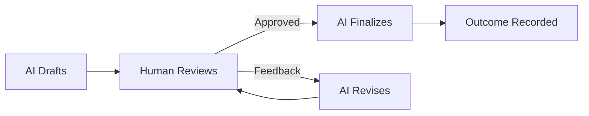

# AI-Human Collaboration Flow

## Standard Collaboration Pattern

The canonical workflow is: AI Draft -> Human Review -> AI Revise



## Decision Recording

| Decision Type | Record Location | Promotion Target |
|---------------|-----------------|------------------|
| Task-specific decisions | workdocs/ (plan.md, context.md) | Archive when complete |
| Stable knowledge | workdocs/ initially | Promote into the relevant skill package under `/.system/skills/ssot/**` |
| Repeated patterns | workdocs/ observations | Abilities or workflows |
| Policy decisions | Review comments | Update AGENTS.md if applicable |

## Review Feedback Format

Humans provide review feedback using inline comments or structured blocks:

```markdown
<!-- REVIEW: [reviewer_name] [date]
Status: approved | needs_revision | blocked
Feedback: Specific feedback text here
-->
```

AI must:
1. Parse and address all needs_revision feedback.
2. Not proceed past blocked status without human resolution.
3. Update workdocs with review outcomes.

## Human Approval Gates

Certain actions require explicit human approval:

| Action Type | Approval Required | Record Method |
|-------------|-------------------|---------------|
| Production deployment | Yes | workdocs/tasks.md checkpoint |
| Security-sensitive changes | Yes | workdocs/tasks.md checkpoint |
| Cross-module breaking changes | Yes | Integration scenario workdocs |
| Credential/secret access | Yes | DevOps scenario workdocs |

AI must stop and request approval when:
- A hook returns requires_human.
- An action is in the "Forbidden without approval" list in applicable AGENTS.md.
- Uncertainty exists about safety implications.

## Related documents

---
> Converted and distributed by [TomeVault](https://tomevault.io/claim/willyu1007) — claim your Tome and manage your conversions.
<!-- tomevault:4.0:skill_md:2026-04-14 -->
