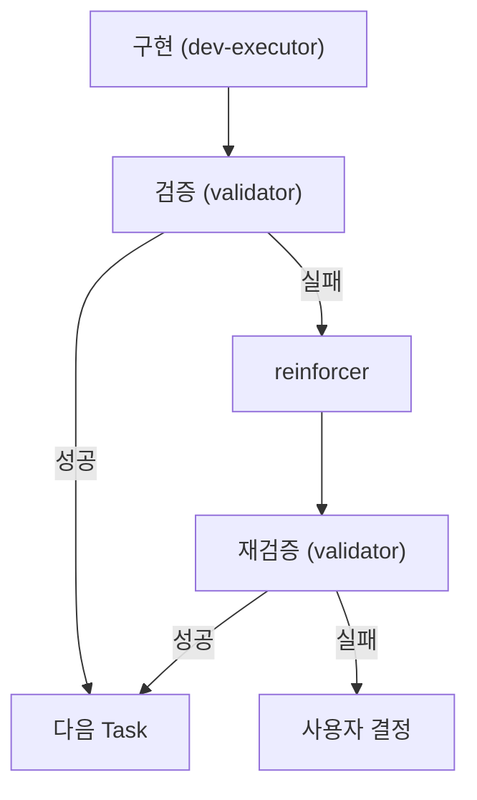
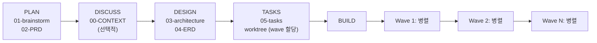

# /dev - 통합 개발 워크플로우

> **Plan → Design → Tasks → Build 전체 사이클 관리**

---

## Data Flow Contract

### Input (스킬 간 데이터 수신)

| 소스 | 데이터 | 용도 |
|------|--------|------|
| `/onboard` | `.claude/project-context/*.md` | 프로젝트 컨텍스트 참조 |
| `/solve` | `.claude/problem-solving/resolved/*/report.md` | 버그 수정 후 기능 전환 시 |

### Output (스킬 간 데이터 전달)

| 단계 | 산출물 | 다음 단계 Input |
|------|--------|----------------|
| `--plan` | `01-brainstorm.md`, `02-PRD.md`, `ROADMAP.md` | `--discuss` 또는 `--design` |
| `--discuss` | `00-CONTEXT.md` (구현 결정) | `--design` |
| `--design` | `03-architecture.md`, `04-ERD.md` | `--tasks` |
| `--tasks` | `05-tasks.md`, `.claude-state/worktree.json` | `--build` |
| `--build` | 소스코드, 테스트코드, `worktree.json` 업데이트 | QA |

### State Update

- `.claude-state/worktree.json` - Task 상태 (pending → in_progress → done)
- `.claude/docs/active/{feature}/ROADMAP.md` - Phase 상태 (planned → in_progress → completed)
- `.claude/memory/CURRENT_CONTEXT.md` - 현재 작업 컨텍스트

---

## 사용법

```bash
/dev [기능명]              # 전체 워크플로우
/dev --plan [기능명]       # 기획 (PRD)
/dev --discuss [기능명]    # 구현 결정 수집 (그레이 영역 해소)
/dev --design [기능명]     # 설계 (아키텍처)
/dev --tasks [기능명]      # 태스크 분해
/dev --build [TASK-ID]     # 단일 Task 구현 (TDD)
/dev --build --wave [N]    # Wave N의 Task 병렬 실행
/dev --build --all         # 모든 Wave 순차 실행 (Wave 내 병렬)
/dev --roadmap             # 로드맵/Phase 상태 조회
/dev --roadmap add "제목"  # Phase 추가 (마지막에)
/dev --roadmap insert N "제목"  # Phase N 앞에 긴급 삽입
/dev --roadmap remove N    # Phase N 삭제 (예정 상태만)
/dev --roadmap complete N  # Phase N 완료 → 다음 Phase 활성화
/dev --roadmap milestone "v1.0.0"  # 마일스톤 생성 + 아카이빙
/dev --status              # 진행 상황
```

---

## Structured Handoffs (단계 간 전제 조건)

| 단계 | 전제 조건 (필수 확인) |
|------|---------------------|
| `--plan` | 없음 (첫 단계) |
| `--discuss` | `01-brainstorm.md` + `02-PRD.md` 존재 확인 |
| `--design` | `02-PRD.md` 존재 필수, `00-CONTEXT.md` 존재 시 참조 |
| `--tasks` | `03-architecture.md` + `04-ERD.md` 존재 확인 |
| `--build` | `05-tasks.md` + `worktree.json` 존재 확인 |

**전제 조건 미충족 시**: 이전 단계 먼저 실행 안내

---

## 에이전트 호출 (필수)

> **⚠️ 이 스킬이 로드되면 아래 지침을 따라 Task 도구를 호출하세요.**

### --plan 단계

**전제 조건**: 없음
**Routing**: `references/plan-phase.md` 참조

```python
Task(
    subagent_type="calab-plugin:planner-phase",
    description="기능 기획",
    prompt="... (references/plan-phase.md 참조)"
)
```

**산출물 필수**: `01-brainstorm.md`, `02-PRD.md`

### --discuss 단계

**전제 조건**: `01-brainstorm.md` + `02-PRD.md` 존재 필수

> **구현 전 그레이 영역을 식별하고 사용자 결정을 수집합니다.**

```python
# 1. PRD 분석하여 구현 결정이 필요한 항목 식별
prd = Read(f".claude/docs/active/{feature}/02-PRD.md")

# 2. 그레이 영역 식별 (best-practices 기반 기본값 제공)
gray_areas = identify_gray_areas(prd)
# 예: 기술 선택, UI/UX 결정, 아키텍처 패턴, API 설계 방식

# 3. AskUserQuestion으로 각 결정 수집
for area in gray_areas:
    answer = AskUserQuestion(
        questions=[{
            "question": area.question,
            "header": area.category,
            "options": area.options,  # best-practices 기반 기본값 포함
            "multiSelect": False
        }]
    )

# 4. 산출물 생성: 00-CONTEXT.md
Write(
    file_path=f".claude/docs/active/{feature}/00-CONTEXT.md",
    content=generate_context_doc(decisions)
)
```

**산출물 필수**: `00-CONTEXT.md`

#### 00-CONTEXT.md 구조

```markdown
# 구현 결정: {feature-name}

## 기술 선택
- **상태 관리**: {선택값} ({근거})
- **데이터 페칭**: {선택값}

## UI/UX 선택
- **레이아웃**: {선택값}
- **테마**: {선택값}

## 아키텍처 선택
- **에러 처리**: {선택값}
- **타입 정의**: {선택값}

## API 설계
- **응답 형식**: {선택값}
- **인증**: {선택값}
```

---

### --design 단계

**전제 조건**: `02-PRD.md` 존재 필수, `00-CONTEXT.md` 존재 시 참조
**Routing**: `references/design-phase.md` 참조

```python
Task(
    subagent_type="calab-plugin:design",
    description="아키텍처 설계",
    prompt="... (references/design-phase.md 참조)"
)
```

**산출물 필수**: `03-architecture.md`, `04-ERD.md`

### --tasks 단계

**전제 조건**: `03-architecture.md` + `04-ERD.md` 존재 필수
**Routing**: `references/tasks-phase.md` 참조

```python
Task(
    subagent_type="calab-plugin:planner-task",
    description="Task 분해",
    prompt="... (references/tasks-phase.md 참조)"
)
```

**산출물 필수**: `05-tasks.md`, `.claude-state/worktree.json`

### --build 단계

**전제 조건**: `05-tasks.md` + `worktree.json` 존재 필수
**Routing**: `references/build-phase.md` 참조

#### 단일 Task 실행 (`--build TASK-ID`)

```python
Task(
    subagent_type="calab-plugin:dev-executor",
    description="TDD 구현",
    prompt="... (references/build-phase.md 참조)"
)
```

#### Wave 병렬 실행 (`--build --wave N` 또는 `--build --all`)

```python
# 1. worktree.json에서 Wave 정보 로드
worktree = Read(".claude-state/worktree.json")
wave_tasks = [t for t in worktree.tasks if t.wave == target_wave]

# 2. Wave 내 Task를 병렬 스폰 (각 executor는 fresh context)
for task in wave_tasks:
    Task(
        subagent_type="calab-plugin:dev-executor",
        description=f"[Wave {target_wave}] {task.subject}",
        prompt=f"""
        ## Task 정의
        - ID: {task.id}
        - Subject: {task.subject}
        - AC: {task.acceptance_criteria}
        - Files: {task.files}

        ## 지침
        - 이 Task만 구현하세요 (다른 Task 코드 읽지 마세요)
        - TDD: RED → GREEN → REFACTOR
        - 완료 후 TaskUpdate(status="completed")
        """,
        run_in_background=True  # 병렬 실행
    )

# 3. 모든 executor 완료 대기 후 다음 Wave 진행
```

#### 전체 Wave 순차 실행 (`--build --all`)

```python
# Wave 1 → Wave 2 → ... → Wave N 순차 실행
# 각 Wave 내부는 병렬 실행
for wave_num in range(1, total_waves + 1):
    execute_wave(wave_num)  # 병렬 스폰 + 완료 대기
    validate_wave(wave_num)  # Wave 완료 검증
```

**산출물 필수**: 소스코드, 테스트코드, `worktree.json` 업데이트

### --roadmap 단계

**전제 조건**: `ROADMAP.md` 존재 시 읽기, 없으면 생성 안내
**Routing**: `references/roadmap-phase.md` 참조

> **Phase 단위 로드맵을 관리합니다. 조회/추가/삽입/삭제/완료/마일스톤.**

```python
# 1. ROADMAP.md 확인
roadmap_path = f".claude/docs/active/{feature}/ROADMAP.md"
roadmap = Read(roadmap_path)  # 없으면 --plan 먼저 실행 안내

# 2. 서브커맨드에 따라 분기
if subcommand == None:
    # 상태 조회 - 현재 Phase 진행률 출력
    display_roadmap_status(roadmap)

elif subcommand == "add":
    # AskUserQuestion으로 Phase 제목/항목 수집
    phase_info = AskUserQuestion(questions=[{
        "question": "추가할 Phase의 이름은?",
        "header": "Phase 추가",
        "options": [
            {"label": "사용자 입력", "description": "직접 Phase 이름 입력"}
        ],
        "multiSelect": False
    }])
    add_phase(feature, phase_info)

elif subcommand == "insert":
    # Phase N 앞에 긴급 삽입
    insert_phase(feature, position=N, title=title)

elif subcommand == "remove":
    # Phase N 삭제 (예정 상태만, 진행 중은 사용자 확인)
    remove_phase(feature, phase_num=N)

elif subcommand == "complete":
    # Phase N 완료 + 다음 Phase 활성화
    complete_phase(feature, phase_num=N)

elif subcommand == "milestone":
    # 마일스톤 생성 + Git 태그 (선택)
    create_milestone(feature, version=version)
```

**산출물 필수**: `ROADMAP.md` 업데이트

---

## Checkpoint 분류 체계

> **모든 사용자 확인 요청을 3가지 타입으로 분류한다.**

| 타입 | 빈도 | 설명 | 예시 |
|------|------|------|------|
| **human-verify** | 90% | 확인/승인만 필요 | "PRD 검토 완료. 진행할까요?", "설계 결과 확인해주세요" |
| **decision** | 9% | 선택지 중 결정 필요 | "JWT vs Session 선택", "모노레포 vs 멀티레포" |
| **human-action** | 1% | 사용자가 직접 행동 | "외부 API 키 발급 필요", ".env 파일 설정 필요" |

### Checkpoint 사용 프로토콜

```python
def create_checkpoint(type, context):
    """Checkpoint 생성 시 타입에 따라 처리 방식 결정"""

    if type == "human-verify":
        # 90% - 간결한 요약 + 자동 진행 옵션
        return {
            "message": f"{context.summary}",
            "options": [
                {"label": "확인, 진행 (권장)", "description": "다음 단계로"},
                {"label": "수정 필요", "description": "변경사항 요청"}
            ],
            "auto_proceed": True  # 타임아웃 시 자동 진행 가능
        }

    elif type == "decision":
        # 9% - 트레이드오프 분석 + 추천안 제시
        return {
            "message": f"{context.question}",
            "options": context.analyzed_options,  # 각 옵션에 장단점 포함
            "recommendation": context.recommended,  # 첫 번째 옵션이 추천
            "auto_proceed": False  # 반드시 사용자 선택 대기
        }

    elif type == "human-action":
        # 1% - 명확한 지시 + 완료 대기
        return {
            "message": f"[사용자 행동 필요] {context.action_required}",
            "steps": context.step_by_step,  # 단계별 가이드
            "auto_proceed": False,  # 행동 완료까지 대기
            "blocking": True
        }
```

### 단계별 Checkpoint 배치

| 워크플로우 단계 | Checkpoint | 타입 |
|----------------|------------|------|
| Plan 완료 | PRD 검토 | human-verify |
| Discuss | 기술 선택 | decision |
| Design 완료 | 아키텍처 검토 | human-verify |
| Tasks 완료 | Task 분해 검토 | human-verify |
| Build 전 | 외부 설정 필요 시 | human-action |
| Wave 완료 | 검증 결과 확인 | human-verify |
| Phase 완료 | 다음 Phase 방향 | decision |

---

## 검증/보강 체인 (필수)



**신뢰도 기반 에스컬레이션**:
- 90%+ → 다음 Task
- 70-89% → reinforcer
- <70% → `/solve` 또는 사용자 결정

---

## 워크플로우 다이어그램



---

## 레퍼런스 라우팅

| 옵션 | 참조 파일 |
|------|----------|
| `--plan` | `references/plan-phase.md` |
| `--discuss` | (인라인 - PRD 분석 → AskUserQuestion) |
| `--design` | `references/design-phase.md` |
| `--tasks` | `references/tasks-phase.md` |
| `--build` | `references/build-phase.md` |
| `--roadmap` | `references/roadmap-phase.md` |
| `--status` | `references/status.md` |
| 모델 프로필 | `references/model-profiles.md` |

## 모델 프로필 관리

> **에이전트별 모델을 프로필로 관리하여 품질/비용/속도 최적화**

### 프로필

| 프로필 | 설명 | 비용 |
|--------|------|------|
| **quality** | 모든 단계 opus | 100% |
| **balanced** | 계획 opus + 실행 sonnet (권장) | ~60% |
| **budget** | 모든 단계 haiku/sonnet | ~30% |

### 설정

```json
// .claude/settings/model-profile.json
{
  "profile": "balanced",
  "overrides": {}
}
```

### 에이전트 호출 시 적용

```python
# 프로필에서 모델 결정
profile = load_model_profile()
model = profile.get_model("dev-executor")  # → "sonnet" (balanced)

Task(
    subagent_type="calab-plugin:dev-executor",
    model=model,  # 프로필 기반
    ...
)
```

상세: `references/model-profiles.md` 참조

---

## 다음 단계 선택 (필수)

| 완료 후 | 권장 |
|--------|------|
| `--plan` | `--discuss` (그레이 영역 있으면) 또는 `--design` (명확하면) |
| `--discuss` | `--design` |
| `--design` | `--tasks` |
| `--tasks` | `--build --all` (Wave 병렬) 또는 `--build TASK-001` (단일) |
| Wave 완료 | 다음 Wave 자동 진행 |
| 모든 Task 완료 | QA 자동 호출 |
| QA 실패 | `/solve` |
| Phase 완료 | `--roadmap complete N` → 다음 Phase `--tasks` |
| 마일스톤 | `--roadmap milestone "vX.Y.Z"` |

> **⚠️ 작업 완료 후 반드시 AskUserQuestion 호출**
>
> 스킬 작업이 완료되면 현재 상황을 분석하여 AskUserQuestion으로 다음 단계 선택지를 제시하세요.
> - 현재 완료된 작업 내용
> - 워크플로우 다음 단계 (권장 표시)
> - 수정/보완 옵션
> - 다른 작업 옵션
> - 종료 옵션

---
> Converted and distributed by [TomeVault](https://tomevault.io/claim/wondermove-inc) — claim your Tome and manage your conversions.
<!-- tomevault:4.0:skill_md:2026-04-13 -->
