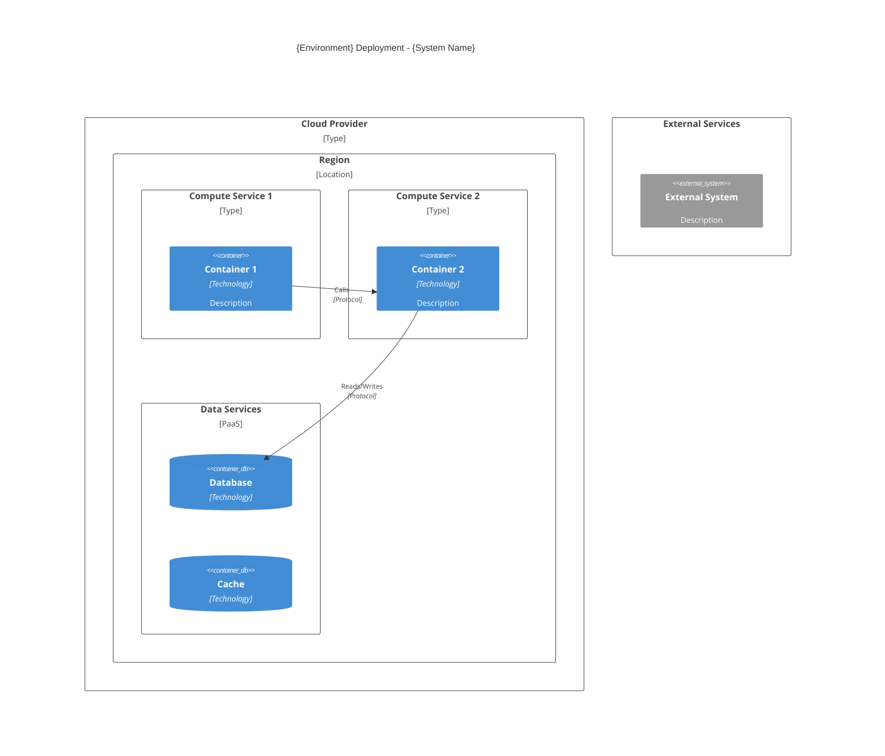

# Deployment Architecture Skill

This skill defines how the deployment architect **maps containers and components to infrastructure services** and maintains deployment specifications. The deployment architect reads from the architecture registry and creates detailed infrastructure specifications that DevOps developers can implement.

---

## Core Principle

**You specify and document; DevOps developers implement.**

```
Architecture Registry (containers, components)
              ↓
     [Deployment Architect]
              ↓
    Deployment Specs + C4 Diagrams
              ↓
     DevOps Developer implements IaC
```

---

## Success Factors

A well-specified deployment meets these criteria:

### 1. Complete Container Mapping

| Criterion | Measure |
|-----------|---------|
| **All Containers Mapped** | Every container has infrastructure assignment |
| **All Components Mapped** | Every component has deployment target |
| **No Orphans** | Nothing deployed without specification |
| **Traceable** | Mapping links to registry entries |

### 2. Clear Infrastructure Specifications

| Criterion | Measure |
|-----------|---------|
| **Implementable** | DevOps can implement from specs alone |
| **Unambiguous** | Service types, sizes, and configs explicit |
| **Cost-Aware** | Resource sizing justified |
| **Scalable** | Scaling triggers and limits defined |

### 3. C4 Diagram Quality

| Criterion | Measure |
|-----------|---------|
| **Complete** | All environments have deployment diagrams |
| **Accurate** | Diagrams match specifications |
| **Current** | Updated when infrastructure changes |
| **Readable** | Clear hierarchy of deployment nodes |

### 4. DevOps Readiness

| Criterion | Measure |
|-----------|---------|
| **IaC-Ready** | Specs translate directly to CDK/Terraform |
| **Pipeline-Ready** | CI/CD stages clearly defined |
| **Runbook-Ready** | Operations procedures documented |
| **Rollback-Ready** | Recovery procedures specified |

---

## Input: What You Receive

### From Architecture Registry

```
.arch-registry/
├── system.md                    # System overview
├── containers/                  # What needs to be deployed
│   └── {container}.md           # Container responsibilities
├── components/{container}/      # Components within containers
│   └── {component}.md           # Component responsibilities
└── deployment/
    └── {environment}.md         # YOUR ASSIGNMENTS
```

### From Constraints

```
.constraints/
├── INFRASTRUCTURE.md    # Cloud provider, compute, networking
└── INTEGRATIONS.md      # External systems
```

### From Container/Component Specs

```
{container}/.specs/
├── components.md        # Components to deploy
└── interfaces/          # APIs that need endpoints
```

---

## Output: What You Create

### Deployment Specifications

```
.specs/deployment/
├── README.md                    # Deployment architecture index
├── overview.md                  # C4 Deployment diagrams + summary
├── container-mapping.md         # Container → Infrastructure mapping
├── environments/
│   ├── README.md                # Environment index
│   ├── development.md           # Dev environment spec
│   ├── staging.md               # Staging environment spec
│   └── production.md            # Production environment spec
├── infrastructure/
│   ├── README.md                # Infrastructure index
│   ├── compute.md               # Compute resources
│   ├── networking.md            # Network topology
│   ├── storage.md               # Storage resources
│   ├── security.md              # Security infrastructure
│   └── monitoring.md            # Observability infrastructure
├── pipelines/
│   ├── README.md                # CI/CD index
│   ├── ci.md                    # Continuous Integration spec
│   └── cd.md                    # Continuous Deployment spec
└── decisions/
    └── ADR-{n}.md               # Deployment-related ADRs
```

---

## Container-to-Infrastructure Mapping

The core deliverable is mapping every container and component to its runtime infrastructure.

### Container Mapping Template

Create `.specs/deployment/container-mapping.md`:

```markdown
# Container-to-Infrastructure Mapping

## Overview

This document maps all containers and components to their infrastructure targets.

## Container Mapping

| Container | Technology | Infrastructure Service | Notes |
|-----------|------------|------------------------|-------|
| frontend | Angular | Azure Static Web Apps | CDN-enabled |
| api | Python/Azure Functions | Azure Functions Premium | Consumption plan |
| ai-services | Python | Azure Container Apps | GPU-enabled |
| orchestration | Python/Durable Functions | Azure Functions Premium | With storage |

## Component Mapping

| Container | Component | Deployment Target | Special Requirements |
|-----------|-----------|-------------------|---------------------|
| ai-services | document-processor | Container Apps Job | Batch processing |
| ai-services | llm-gateway | Container Apps | High memory |
| api | tender-handler | Functions App | HTTP trigger |

## Data Services

| Service | Type | Used By | Notes |
|---------|------|---------|-------|
| PostgreSQL | Azure Database | api, orchestration | Primary data store |
| Blob Storage | Azure Storage | ai-services, api | Document storage |
| Redis | Azure Cache | api | Session/cache |
| Service Bus | Azure Service Bus | All | Event messaging |

## External Integrations

| Integration | Service | Configuration |
|-------------|---------|---------------|
| Entra ID | Azure AD B2C | Authentication |
| OpenAI | Azure OpenAI | AI completions |
```

---

## C4 Deployment Diagram

Maintain C4 Deployment diagrams showing which containers run on which infrastructure.

### Diagram Location

Create and maintain in `.specs/deployment/overview.md`.

### Diagram Template



### Deployment Node Types

| Node Type | Examples | Use For |
|-----------|----------|---------|
| Cloud Provider | Azure, AWS, GCP | Top-level boundary |
| Region | westeurope, us-east-1 | Geographic location |
| Network | VNET, VPC | Network boundary |
| Compute | Functions, Container Apps, EKS | Container/VM host |
| Data | Azure DB, RDS, CosmosDB | Database host |
| Cache | Redis, ElastiCache | Cache host |
| CDN | Azure CDN, CloudFront | Edge delivery |
| Messaging | Service Bus, SQS | Message broker |

---

## Workflow: Greenfield (New System)

### Step 1: Read Your Assignments

```
Read:
├── .arch-registry/deployment/*.md          → Your responsibilities
├── .arch-registry/containers/              → What needs deploying
├── .arch-registry/components/              → Component details
├── .constraints/INFRASTRUCTURE.md          → Infrastructure constraints
└── .constraints/INTEGRATIONS.md            → External dependencies
```

### Step 2: Create Container-to-Infrastructure Mapping

Create `.specs/deployment/container-mapping.md` with:
- Every container mapped to infrastructure service
- Every component mapped to deployment target
- Data services identified
- External integrations listed

### Step 3: Create Deployment Overview with C4 Diagrams

Create `.specs/deployment/overview.md` with:
- Registry assignment links
- **C4 Deployment diagram for each environment**
- Infrastructure summary from constraints

### Step 4: Specify Each Environment

Create `.specs/deployment/environments/{env}.md` for each environment:

```markdown
# Environment: {Environment Name}

## Registry Assignment

[link](../../../.arch-registry/deployment/{env}.md)

## Overview

- **Purpose**: {Production/Staging/Development}
- **URL**: {Base URL}

## C4 Deployment Diagram

​```mermaid
C4Deployment
    title {Environment} Deployment
    ...
​```

## Infrastructure Resources

| Resource | Service | Size/Tier | Purpose |
|----------|---------|-----------|---------|
| Compute | {Service} | {tier} | {purpose} |
| Database | {Service} | {tier} | {purpose} |

## Scaling Configuration

| Resource | Min | Max | Trigger |
|----------|-----|-----|---------|
| API | 2 | 10 | CPU > 70% |

## Security

| Control | Implementation |
|---------|----------------|
| Network | {VPC/Security Groups} |
| Secrets | {Secrets Manager} |
| IAM | {Role-based access} |

## Monitoring

| Type | Service | Config |
|------|---------|--------|
| Logs | {Service} | {retention} |
| Metrics | {Service} | {SLIs} |
| Alerts | {Service} | {escalation} |
```

### Step 5: Specify Infrastructure

Create detailed specs in `.specs/deployment/infrastructure/`:

- **compute.md** - Container orchestration, sizing, scaling
- **networking.md** - Network topology, security groups
- **storage.md** - Databases, file storage, caching
- **security.md** - IAM, encryption, secrets management
- **monitoring.md** - Logs, metrics, alerts, traces

### Step 6: Specify CI/CD Pipelines

Create `.specs/deployment/pipelines/`:

**ci.md** - Continuous Integration:
```markdown
# Continuous Integration Pipeline

## Pipeline Stages

​```mermaid
graph LR
    A[Source] --> B[Build]
    B --> C[Test]
    C --> D[Scan]
    D --> E[Package]
    E --> F[Publish]
​```

## Stage Details

### Build
- **Tool**: {Docker/etc.}
- **Steps**: {build steps}

### Test
- **Unit**: {framework, coverage target}
- **Integration**: {key paths}

### Security Scan
- **SAST**: {tool}
- **Container**: {tool}

### Publish
- **Registry**: {container registry}
- **Tag Strategy**: {strategy}

## Quality Gates

| Gate | Threshold | Action |
|------|-----------|--------|
| Coverage | >= 80% | Block |
| Critical CVEs | 0 | Block |
```

**cd.md** - Continuous Deployment:
```markdown
# Continuous Deployment Pipeline

## Deployment Flow

​```mermaid
graph LR
    A[Artifact] --> B[Dev]
    B --> C[Staging]
    C --> D{Approval}
    D -->|Yes| E[Production]
​```

## Environment Progression

| Environment | Trigger | Approval |
|-------------|---------|----------|
| Development | Auto on merge | None |
| Staging | Auto after dev | None |
| Production | Manual | Required |

## Rollback

- **Trigger**: {conditions}
- **Strategy**: {how}
- **Recovery Time**: {target}
```

---

## Workflow: Brownfield (Feature Request)

When upstream architects add `## Proposed Changes` affecting deployment:

### Step 1: Read Proposed Changes

Check for `## Proposed Changes - {Feature Name}` in:
- `.arch-registry/deployment/{env}.md`
- `{container}/.specs/components.md` (new containers/components)

### Step 2: Analyze Impact

| Proposed Change | Impact | Action |
|-----------------|--------|--------|
| New container | Infrastructure needed | Add to mapping, update diagrams |
| New component | Deployment target needed | Add to mapping |
| Scaling change | Resource specs | Update environment specs |
| New integration | Networking/security | Update infrastructure specs |

### Step 3: Update Specifications

- Update `container-mapping.md` with new mappings
- **Update C4 Deployment diagrams in `overview.md`**
- Update environment specs in `environments/`
- Update infrastructure specs if needed
- Create ADR for significant decisions

### Step 4: Propose Changes for DevOps

Add `## Proposed Changes` to affected deployment specs:

```markdown
---

## Proposed Changes - {Feature Name}

**Feature ID**: FR-xxx
**Status**: Proposed
**Proposed By**: deployment-architect
**Date**: {YYYY-MM-DD}

### Summary
{What infrastructure changes this feature requires}

### New Infrastructure Requirements

| Resource | Type | Purpose |
|----------|------|---------|
| {resource} | {service} | {why needed} |

### Container Mapping Changes

| Container/Component | Current | Proposed |
|---------------------|---------|----------|
| {name} | {current or N/A} | {new mapping} |

### Diagram Updates

{Description of C4 Deployment diagram changes}

### Cost Impact

| Resource | Monthly Estimate |
|----------|------------------|
| {resource} | ${amount} |

### Acceptance Criteria

- [ ] {Criterion 1}
- [ ] {Criterion 2}
```

---

## Best Practices

### DO:

1. **Map everything** - Every container and component needs infrastructure
2. **Maintain diagrams** - C4 Deployment diagrams must stay current
3. **Specify clearly** - DevOps needs exact service types and sizes
4. **Design for failure** - Assume components will fail
5. **Automate everything** - No manual deployments
6. **Document costs** - Infrastructure has cost implications
7. **Use proposed changes** - Never modify specs directly for brownfield

### DON'T:

1. **Leave unmapped containers** - Everything needs a home
2. **Write vague specs** - "cloud database" isn't enough
3. **Skip diagrams** - Visual documentation is essential
4. **Create SPOFs** - Single points of failure
5. **Hard-code config** - Use environment variables/secrets
6. **Ignore security** - Build security in from start
7. **Skip rollback plans** - Every deployment needs recovery

---

## Quality Checklists

### Greenfield Checklist

- [ ] Read `.arch-registry/deployment/*.md` for responsibilities
- [ ] Read `.arch-registry/containers/` for containers to deploy
- [ ] Read `.arch-registry/components/` for components to deploy
- [ ] Read `.constraints/INFRASTRUCTURE.md` for constraints
- [ ] Create `.specs/deployment/` directory structure
- [ ] Create `container-mapping.md` with all mappings
- [ ] **Create C4 Deployment diagrams in `overview.md`**
- [ ] Specify each environment in `environments/`
- [ ] Define infrastructure in `infrastructure/`
- [ ] Define pipelines in `pipelines/`
- [ ] Verify all containers/components have deployment targets
- [ ] Create `README.md` index

### Brownfield Checklist

- [ ] Read `## Proposed Changes` from upstream architects
- [ ] Analyze impact on deployment infrastructure
- [ ] Update `container-mapping.md`
- [ ] **Update C4 Deployment diagrams**
- [ ] Update environment specifications
- [ ] Update infrastructure specifications
- [ ] Update pipeline specifications if needed
- [ ] Create `## Proposed Changes` for DevOps developers
- [ ] Create ADR for significant decisions

### C4 Diagram Maintenance Checklist

- [ ] C4 Deployment diagram exists in `.specs/deployment/overview.md`
- [ ] Diagram shows all containers and their infrastructure hosts
- [ ] Diagram shows data services and integrations
- [ ] Diagram updated when containers/components are added/removed
- [ ] Per-environment diagrams in `environments/{env}.md`

### Pre-Handoff Checklist (to DevOps)

- [ ] All containers mapped to infrastructure services
- [ ] All components have deployment targets
- [ ] C4 Deployment diagrams complete and accurate
- [ ] Resource sizing specified
- [ ] Scaling configuration defined
- [ ] Security requirements documented
- [ ] Pipeline stages defined
- [ ] Rollback procedures specified

---

## Anti-Patterns

| Anti-Pattern | Problem | Solution |
|--------------|---------|----------|
| **Unmapped Containers** | Containers without infrastructure | Map everything |
| **Vague Specifications** | "Use a database" isn't implementable | Specify exact services and sizes |
| **Missing Diagrams** | No visual documentation | Maintain C4 Deployment diagrams |
| **Single Point of Failure** | No redundancy | Design for failure |
| **Manual Deployments** | Human error, slow recovery | Automate everything |
| **Security Afterthought** | Vulnerabilities | Include security from start |
| **No Rollback Plan** | Can't recover from failures | Specify rollback procedures |
| **Cost Blindness** | Budget surprises | Document cost implications |

---
> Converted and distributed by [TomeVault](https://tomevault.io/claim/wtah) — claim your Tome and manage your conversions.
<!-- tomevault:4.0:skill_md:2026-04-14 -->
