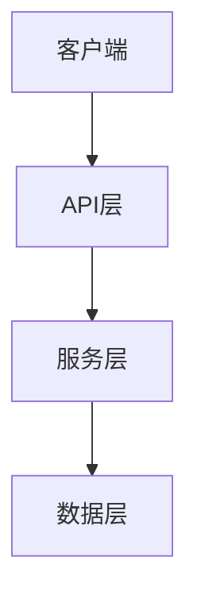
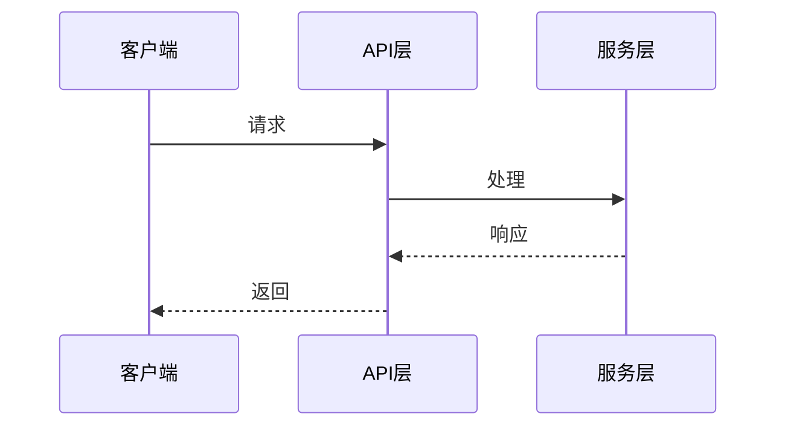
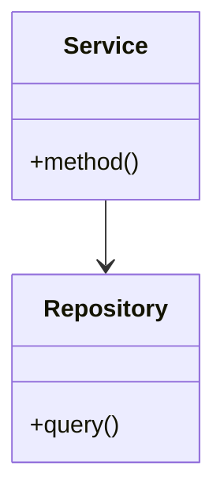
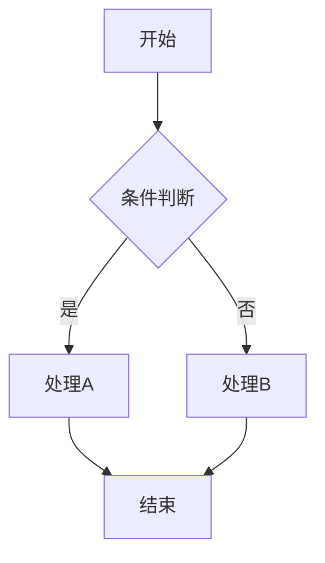
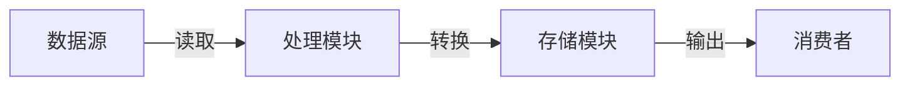
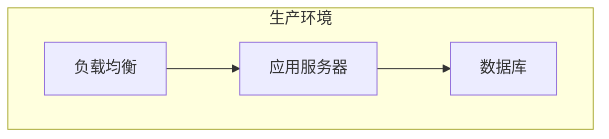

# 架构设计技能

## 何时使用

- 新建项目时：根据需求文档进行正向架构设计
- 变更开发时：在代码理解输出的逆向设计书基础上做增量架构设计
- 需要进行模块划分、接口定义、技术选型时

## 输出格式

- 架构文档：按 `process_templates/architecture.md` 模板（必须包含 Mermaid/PlantUML 图表）
- 接口定义：按 `process_templates/interfaces.json` 格式
- 设计评审：按 `process_templates/design_review.md` 模板

## 输出规范

架构文档必须包含以下章节，缺少任何必填章节则视为不完整：

| 章节       | 必填 | 说明                                     |
| ---------- | ---- | ---------------------------------------- |
| Overview   | 是   | 项目概述、架构风格、关键决策             |
| 架构块图   | 是   | 系统整体结构的 Mermaid 图                |
| Components | 是   | 模块列表，每个模块含名称、职责、对外接口 |
| Data Flow  | 是   | 数据在模块间的流转描述                   |
| 接口定义   | 是   | 引用 interfaces.json                     |
| 技术选型   | 是   | 候选方案对比与推荐                       |
| 非功能需求 | 是   | 性能、可靠性、可观测性                   |
| 时序图     | 按需 | 有异步/多模块协作时必选                  |
| 类图       | 按需 | 面向对象设计时必选                       |
| 流程图     | 按需 | 复杂业务逻辑或决策分支时必选             |
| 数据流图   | 按需 | 数据管道或ETL场景时推荐                  |
| 部署图     | 按需 | 涉及多服务/容器部署时推荐                |

## 设计步骤

### 1. 约束分析

- 技术约束（语言、框架、平台）
- 性能约束（响应时间、吞吐量）
- 安全约束（认证、加密、合规）
- 部署约束（单机、容器、云原生）

### 2. 模块划分

- 按职责单一原则划分模块
- 每个模块包含：名称、职责、对外接口
- 模块间低耦合、模块内高内聚
- 明确模块间的依赖方向（禁止循环依赖）

### 3. 接口定义

按以下格式输出到 `interfaces.json`：

```json
{
  "from": "模块A",
  "to": "模块B",
  "contract": "接口名称",
  "method": "GET/POST/调用方式",
  "input": "输入格式",
  "output": "输出格式",
  "error": "错误响应格式"
}
```

### 4. 技术选型

- 列出候选方案与对比（至少 2 个候选）
- 从性能、生态、团队熟悉度、维护成本 4 个维度评估
- 给出推荐方案与理由

### 5. 架构图表

根据项目特征选择需要的图表类型，使用 Mermaid 语法嵌入到 architecture.md 中。

#### 5.1 架构块图（所有项目必选）

展示系统整体结构和模块关系：



#### 5.2 时序图（有异步/多模块协作时必选）

展示关键业务流程的模块间交互：



#### 5.3 类图（面向对象设计时必选）

展示核心类及关系：



#### 5.4 流程图（复杂业务逻辑时必选）

展示决策分支和处理流程：



#### 5.5 数据流图（数据管道场景推荐）



#### 5.6 部署图（多服务部署推荐）



### 6. 图表选择矩阵

根据项目类型快速判断需要哪些图：

| 项目类型      | 块图 | 时序图 | 类图 | 流程图 | 数据流图 | 部署图 |
| ------------- | ---- | ------ | ---- | ------ | -------- | ------ |
| Web API 服务  | ✅   | ✅     | ✅   | 按需   | 按需     | 按需   |
| CLI 工具      | ✅   | 按需   | 按需 | ✅     | 按需     | ❌     |
| 微服务架构    | ✅   | ✅     | ✅   | 按需   | ✅       | ✅     |
| 数据处理管道  | ✅   | 按需   | 按需 | ✅     | ✅       | 按需   |
| 桌面/GUI 应用 | ✅   | ✅     | ✅   | ✅     | 按需     | 按需   |
| 库/SDK        | ✅   | 按需   | ✅   | 按需   | ❌       | ❌     |

### 7. 设计自评审

输出设计前，按以下清单自检：

- [ ] 所有需求的功能点均有对应模块承载
- [ ] 模块间无循环依赖
- [ ] 接口定义完整（输入、输出、错误）
- [ ] 架构块图已包含所有模块
- [ ] 按需图表已补充（时序图、类图、流程图等）
- [ ] 非功能需求有对应的技术方案
- [ ] 技术风险已标注

评审通过后输出 `design_review.md`，设置 `workflow_state.json` 的 `status: approved`。
评审不通过时，记录问题并重新修改设计，不得跳过。

## 逆向模式指导（change-project）

当接收到 `code-understanding` 技能输出的逆向分析结果时：

1. 将逆向分析的模块清单作为架构设计的**基线**
2. 在基线架构上标注需要变更的模块（新增/修改/删除）
3. 评估变更对现有模块的**影响范围**
4. 更新架构图中受影响的部分
5. 在 architecture.md 中标注 `mode: update`，说明变更前后的差异

---
> Converted and distributed by [TomeVault](https://tomevault.io/claim/xshanesong) — claim your Tome and manage your conversions.
<!-- tomevault:4.0:skill_md:2026-04-14 -->
