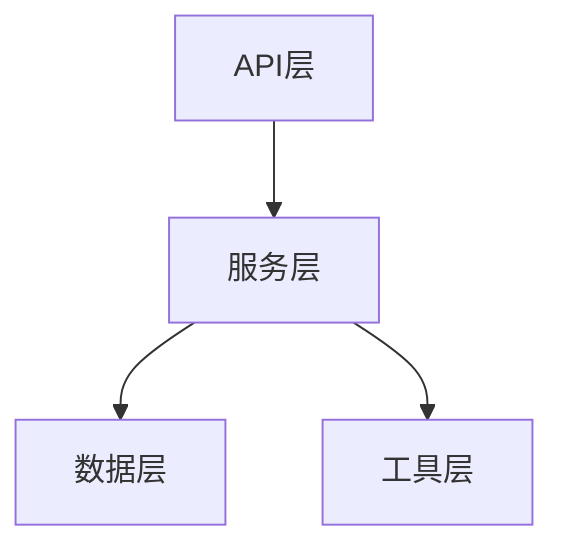

# 代码理解技能

## 何时使用

- 变更开发（change-project）模式下，在需求分析前执行代码理解
- 需要分析现有代码库的结构、依赖关系、接口定义时
- 需要为已有项目生成或更新架构设计文档时

## 输出格式

- 逆向架构设计书：按 `process_templates/architecture.md` 模板格式，`mode: reverse`
- 逆向接口定义：按 `process_templates/interfaces.json` 格式
- 代码分析摘要：作为架构设计书的附录章节

## 输出规范

逆向设计书必须包含以下内容，缺少任何必填项视为不完整：

| 内容         | 必填 | 说明                            |
| ------------ | ---- | ------------------------------- |
| 项目结构概览 | 是   | 目录树、入口文件、框架类型      |
| 模块划分     | 是   | 每个模块的名称、职责、文件范围  |
| 架构块图     | 是   | Mermaid 格式的系统结构图        |
| 接口清单     | 是   | 公共 API / 路由 / 服务接口      |
| 依赖关系     | 是   | 外部依赖 + 内部模块间依赖       |
| 数据流       | 是   | 关键数据路径描述                |
| 现有测试评估 | 是   | 测试覆盖情况和质量              |
| 编码风格     | 是   | 现有代码的风格基线和一致性评估  |
| 静态检查结果 | 是   | Linter / 静态分析工具的检查结果 |
| 时序图       | 按需 | 关键业务流程的调用链            |
| 类图         | 按需 | 核心类及关系                    |
| 风险点       | 按需 | 发现的技术债务或设计问题        |

## 分析步骤

### 1. 项目结构扫描

- 生成目录树（排除 node_modules、**pycache**、bin/obj 等构建产物）
- 识别入口文件（main.py、Program.cs、index.ts、main.go 等）
- 检测项目框架（从配置文件和依赖推断：FastAPI、ASP.NET Core、Express、Spring Boot 等）
- 识别项目类型（Web API / CLI / 库 / 桌面应用）

### 2. 模块划分识别

- 按目录结构和命名空间识别模块边界
- 为每个模块梳理职责（从文件名、类名、函数名、注释推断）
- 绘制 Mermaid 架构块图展示模块间关系
- 标注模块的代码量（文件数、大致行数）

### 3. 依赖关系分析

**外部依赖**：

- 从包管理文件提取（requirements.txt / package.json / .csproj / go.mod / Cargo.toml）
- 列出每个依赖的用途和版本

**内部依赖**：

- 分析 import/using/require 语句，绘制模块间依赖图
- 检测是否存在循环依赖
- 输出依赖方向图（Mermaid 格式）

### 4. 接口提取

- **HTTP/RPC 接口**：提取路由定义、请求方法、请求/响应格式
- **服务接口**：提取公共方法签名、参数类型、返回类型
- **数据模型**：提取实体类/结构体定义，包含字段名和类型
- 按 `interfaces.json` 格式输出

### 5. 数据流追踪

- 从入口文件出发，追踪关键数据的完整路径
- 标注数据经过的模块和转换操作
- 识别数据的持久化方式（数据库、文件、缓存等）
- 用时序图展示关键数据流的调用链

### 6. 现有测试评估

- 统计测试文件和测试用例数量
- 识别已覆盖的模块和未覆盖的模块
- 评估测试类型分布（单元 / 集成 / 接口 / 系统）
- 检查测试质量（是否有断言、是否测试了异常路径）
- 输出评估结论：
  - ✅ 测试充分：覆盖率 ≥70%，各层均有测试
  - ⚠️ 测试不足：覆盖率 <70% 或某层缺失
  - ❌ 无测试：没有测试代码

### 7. 编码风格识别

**目的**：识别现有代码库遵循的编码风格基线，为后续变更开发提供风格参考。

**分析要点**：

- 缩进方式（空格 / Tab）和缩进宽度
- 命名风格（camelCase / snake_case / PascalCase）在变量、函数、类、常量中的使用模式
- 括号风格（K&R / Allman / 同行）
- 导入/引用的排列顺序和分组规则
- 注释风格（单行 / 多行 / 文档注释格式）
- 文件组织惯例（类的排列顺序、公共/私有成员顺序）

**一致性评估**：

- ✅ 风格一致：整个项目遵循统一风格
- ⚠️ 风格混杂：不同模块/文件风格不一致（列出差异点）
- ❌ 无明确风格：代码风格随意，无规律可循

**风格参考选择规则**：

1. 项目已有 `.editorconfig` / linter 配置（`.eslintrc`、`pyproject.toml [tool.black]`、`.clang-format` 等）→ 以配置为准
2. 项目无配置但风格一致 → 以现有风格为基线
3. 项目风格混杂或无明确风格 → 推荐采用 Google Style Guide（参考 `copilot-instructions.md` 中的「Google Style Guide 语言对照表」）

### 8. 代码静态检查

**目的**：对现有代码执行静态分析，发现潜在缺陷和违规项，作为逆向设计书的质量附录。

**执行步骤**：

1. 根据语言选择合适的 Linter 和静态分析工具（参考 `copilot-instructions.md` 中的「Linter / 静态分析工具对照表」）
2. 以默认规则集执行检查，记录结果
3. 将结果按严重程度分类（Error / Warning / Info）
4. 高严重度问题标注在逆向设计书的"风险点"章节

**评估标准**：

- ✅ 无高严重度问题
- ⚠️ 存在少量高严重度问题（≤5 个）
- ❌ 存在大量高严重度问题（>5 个），需在风险点中重点标注

## 分析结果的使用方式

逆向设计书是后续流程的**基线文档**：

1. **PM 使用**：理解现有系统范围，更准确地进行变更需求分析
2. **Architect 使用**：在逆向基线上做增量架构设计，避免推翻现有设计
3. **Developer 使用**：了解代码结构和编码风格基线，定位变更点，保持风格一致性
4. **Tester 使用**：了解已有测试覆盖和静态检查基线，制定增量测试计划

## 注意事项

- 分析必须基于**实际代码**，不得凭空推测
- 遇到无法判断的模块职责时，标注为"待确认"
- 大型项目可分模块逐步分析，但最终必须输出完整的逆向设计书
- 发现的技术债务和风险点需在分析摘要中明确标注
- 逆向设计书的架构图必须准确反映**当前**代码结构，而非理想状态
- 编码风格分析应覆盖至少 3 个不同模块的代码文件，确保样本充分
- 静态检查应使用工具默认规则集，不自定义规则（反映项目真实状态）

---
> Converted and distributed by [TomeVault](https://tomevault.io/claim/xshanesong) — claim your Tome and manage your conversions.
<!-- tomevault:4.0:skill_md:2026-04-14 -->
