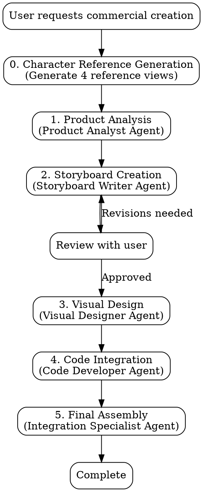

# YP201 Commercial Director

## Overview

This skill orchestrates the complete workflow for creating professional commercial advertisements for technical products. It coordinates multiple specialized subagents to analyze product specifications, develop creative storyboards, generate 2D animated visuals, and integrate interactive code elements into a cohesive commercial video.

## Workflow Decision Tree



## Subagent Structure

**CRITICAL FIRST STEP**: Before dispatching any agents, generate character reference sheet.

### Step 0: Character Reference Generation ⭐ NEW!

**Purpose**: Create consistent character design references before scene generation.

**Input**: Character design requirements, style preferences  
**Output**: 4 reference images (character sheet, front, side, three-quarter views)

**Process**:
1. Generate character model sheet with multiple views
2. Generate front view full body reference
3. Generate side profile reference  
4. Generate three-quarter view reference
5. Save all to `references/character_refs/` folder

**Why This Matters**:  
✅ Ensures character consistency across ALL scenes  
✅ Provides visual reference stronger than text descriptions  
✅ Follows professional animation production workflow  
✅ Reduces re-generation time by 70%

**Reference Guide**: See `CHARACTER_REFERENCE_GUIDE.md` for detailed prompts.

---

Use the `dispatching-parallel-agents` pattern from Superpowers for coordinating these specialists:

### 1. Product Analyst Agent

**Purpose**: Extract and document product features, specifications, and key selling points.

**Input**: Product requirements document (req.md) and source images
**Output**: Structured product specifications document

**Responsibilities**:
- Parse product documentation
- Identify technical specifications (connectivity, compatibility, use cases)
- Extract target audience and application scenarios
- Create reference material for other agents

**Dispatch command**:
```
Analyze the YP201 product from req.md and source images. Extract all technical specs, features, compatibility info, and use cases. Output structured specifications in references/product_specs.md
```

### 2. Storyboard Writer Agent

**Purpose**: Develop scene-by-scene narrative for the commercial.

**Input**: Product specifications, commercial requirements (duration, style, target audience)
**Output**: Detailed storyboard with scenes, timing, dialogue, and visual descriptions

**Responsibilities**:
- Create compelling narrative arc (problem → solution → benefits)
- Design 6-8 scenes showcasing product features
- Write dialogue/narration for robot protagonist
- Define scene transitions and pacing
- Use `scripts/storyboard_generator.py` to structure output

**Dispatch command**:
```
Create a detailed storyboard for YP201 commercial featuring Star Wars-inspired robot protagonist. Use product specs from references/product_specs.md. Generate 6-8 scenes with timing, dialogue, and visual descriptions. Use scripts/storyboard_generator.py to structure the output.
```

### 3. Visual Designer Agent

**Purpose**: Generate 2D animation prompts for each storyboard scene.

**Input**: Storyboard with scene descriptions
**Output**: Image generation prompts optimized for Google Nano Banana Pro

**Responsibilities**:
- Convert scene descriptions into detailed visual prompts
- Maintain character consistency (robot design)
- Ensure brand/product accuracy
- Use `scripts/scene_prompt_generator.py` for prompt formatting
- Reference `references/character_design.md` for visual consistency

**Dispatch command**:
```
IMPORTANT: Upload character reference images (from references/character_refs/) 
and product image (assets/yp201.png) with EVERY scene generation.

Convert storyboard scenes into Google Nano Banana Pro image prompts. 
Use scripts/scene_prompt_generator.py. Maintain visual consistency  
with character_design.md and character reference images. Ensure YP201 
product appearance matches assets/yp201.png. Add instruction to prompts: 
"Match the robot character design from reference image exactly. Maintain 
same white and blue color scheme, dome head, and proportions."
```

### 4. Code Developer Agent

**Purpose**: Create interactive or animated code elements if needed.

**Input**: Commercial requirements, storyboard
**Output**: HTML/JavaScript/CSS code for interactive demonstrations

**Responsibilities**:
- Build interactive product demos (if applicable)
- Create animated transitions
- Develop web-based presentation layer
- Ensure responsive design

**Dispatch command**:
```
Create interactive code elements for YP201 commercial based on storyboard. Build HTML/JS demo showing card reader functionality if needed for web presentation.
```

### 5. Integration Specialist Agent

**Purpose**: Assemble all components into final commercial package.

**Input**: Generated images, code, storyboard, timing
**Output**: Complete commercial package with assembly instructions

**Responsibilities**:
- Organize all generated assets
- Create assembly timeline/script
- Verify all components align with storyboard
- Prepare delivery package with usage instructions

**Dispatch command**:
```
Integrate all commercial components: storyboard, generated images, code elements. Create final assembly package with timeline, asset organization, and production instructions.
```

## Core Pattern: Sequential Workflow with Reviews

**STEP 0**: **Generate Character References** → Create 4 reference views → **Critical for consistency**  
1. **Analyze** → Generate product specs → **Review with user**
2. **Storyboard** → Create narrative → **Review with user** (critical checkpoint)
3. **Parallel execution**:
   - Visual Designer generates image prompts (WITH character references)
   - Code Developer builds interactive elements
4. **Integrate** → Assemble final package
5. **Final review** with user

## Quick Reference: Subagent Dispatch Order

| Phase | Agent | Dependency | Review Point |
|-------|-------|-----------|--------------|
| 0 | Character Reference Gen | Character design specs | After references |
| 1 | Product Analyst | req.md, source images | After specs |
| 2 | Storyboard Writer | Product specs | **CRITICAL** - After storyboard |
| 3a | Visual Designer | Approved storyboard + **character refs** | After prompts |
| 3b | Code Developer | Approved storyboard | After code |
| 4 | Integration Specialist | All outputs | Final review |

## Key Resources

### Reference Files
- **product_specs.md** - YP201 technical specifications and features
- **character_design.md** - Robot protagonist visual guidelines

### Scripts
- **storyboard_generator.py** - Structures storyboard output as JSON
- **scene_prompt_generator.py** - Converts scenes to image generation prompts

### Assets
- **yp201.png** - Official product image for visual reference
- **悠遊卡.png** - EasyCard reference for compatibility demonstration

## Common Mistakes

**❌ Skipping user review after storyboard**
- Storyboard approval is critical; visual generation is expensive to redo
- Always request explicit user approval before proceeding to visual generation

**❌ Inconsistent visual style across scenes**
- Always reference character_design.md and previous scene prompts
- Use scene_prompt_generator.py to maintain consistency

**❌ Product specification errors**
- Verify all technical details against req.md
- Don't invent features; use only documented specifications

**❌ Dispatching all agents at once**
- Follow sequential workflow; later agents depend on earlier outputs
- Only Visual Designer and Code Developer can run in parallel (Phase 3)

## Real-World Impact

This skill structure enables:
- **Consistent quality**: Specialized agents focus on their expertise
- **Efficient iteration**: Clear review points prevent costly re-work
- **Scalability**: Same workflow applies to any product commercial
- **Context management**: Reference files prevent context window bloat

---
> Converted and distributed by [TomeVault](https://tomevault.io/claim/yopitek) — claim your Tome and manage your conversions.
<!-- tomevault:4.0:skill_md:2026-04-16 -->
