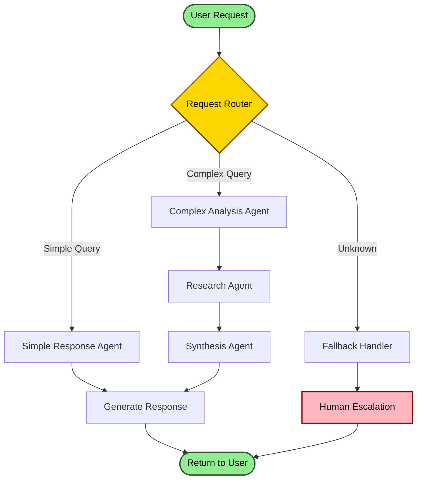
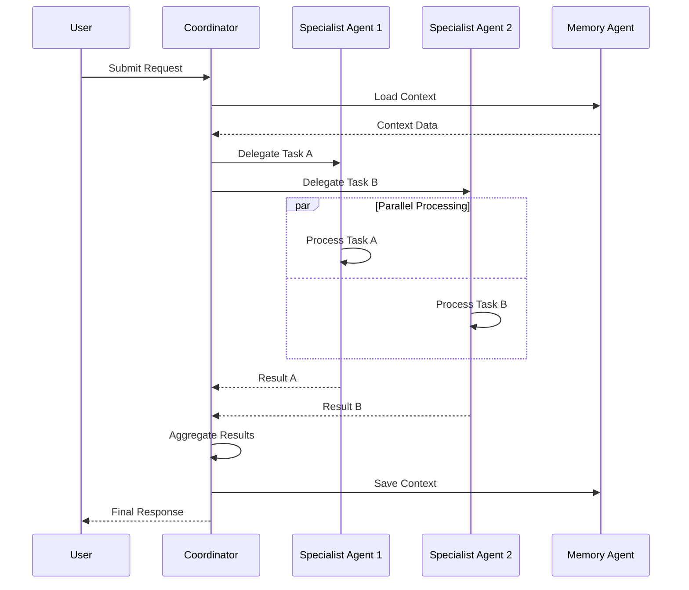
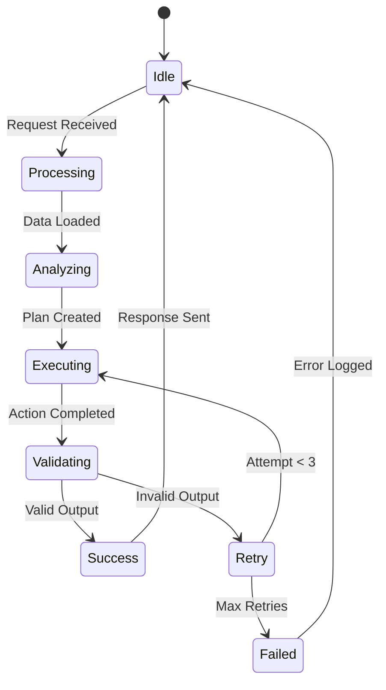

# Agentic AI Architecture Designer

## Overview

This skill designs complete agentic AI architectures from user ideas. It analyzes requirements and generates comprehensive architecture documentation with file outputs including valid Mermaid diagrams, MCP configurations, and implementation guides. The skill creates four key deliverables: architecture.md, workflow.mermaid, mcp-config.json, and implementation-notes.md files.

## Instructions

### Step 1: Gather Requirements

Before designing, ask these questions if not provided:

**Core Requirements:**
1. **What problem does this agent system solve?** (specific use case)
2. **What's the scale?** (small tool, team platform, or enterprise system)
3. **What's the expected volume?** (requests per day/hour, concurrent users)
4. **What LLM/model will be used?** (Claude, GPT-4, local models, mix)

**Technical Context:**
5. **Deployment target?** (cloud, on-prem, edge, hybrid)
6. **Existing systems to integrate?** (databases, APIs, tools)
7. **Budget constraints?** (API costs per month, infrastructure limits)
8. **Complexity tolerance?** (simple MVP, production-ready, enterprise-grade)

**Operational:**
9. **Human-in-the-loop required?** (fully autonomous, approval needed, oversight)
10. **Response time requirements?** (real-time, near-real-time, batch processing)

### Step 2: Analyze and Design

1. **Analyze the requirements**:
   - Identify core objectives and success criteria
   - Determine agent types needed (coordinator, specialist, memory, validator)
   - Map data flows and agent interactions
   - Assess scalability and performance needs
   - Estimate costs (LLM calls per workflow × expected volume)

2. **Design architecture** considering:

   - Agent roles and responsibilities (avoid overlap)
   - Communication patterns (sync vs async, message bus vs direct)
   - Memory and state management (short-term, long-term, shared)
   - Error handling and recovery (retry logic, fallbacks, circuit breakers)
   - Security considerations (auth, data privacy, rate limiting)
   - Monitoring and observability (logging, metrics, tracing)
   - Cost optimization (minimize LLM calls, caching strategies)

### Step 3: Create Output Directory Structure

Create organized architecture documentation:

```
./architecture/[project-name]/
├── architecture.md           # Main architecture document
├── diagrams/
│   ├── workflow.mermaid     # Agent workflow diagram
│   ├── sequence.mermaid     # Interaction sequences (optional)
│   └── components.mermaid   # System components (optional)
├── config/
│   └── mcp-config.json      # MCP configuration
└── implementation-notes.md   # Implementation guide
```

If project root already has `/docs` or `/architecture`, use that location.

### Step 4: Generate architecture.md

Use this template structure:

```markdown
# [Project Name] - AI Agent Architecture

## 1. System Overview
- Purpose and goals
- Key capabilities
- Target users/use cases
- Success metrics

## 2. Architecture Diagram
[High-level component diagram or reference to Mermaid file]

## 3. Agent Inventory
| Agent Name | Type | Responsibilities | Input | Output |
|------------|------|------------------|-------|--------|
| [Name] | Coordinator/Specialist | [What it does] | [Data] | [Data] |

## 4. Communication Patterns
- How agents communicate (message bus, direct calls, events)
- Synchronous vs asynchronous flows
- Message formats and protocols

## 5. Data Flow
- End-to-end request flow
- Data transformations at each stage
- State management approach

## 6. Memory & State Management
- Short-term memory (conversation context)
- Long-term memory (persistent storage)
- Shared state between agents

## 7. Error Handling Strategy
- Retry policies
- Fallback behaviors
- Circuit breakers
- Error escalation paths

## 8. Security Model
- Authentication and authorization
- Data privacy and encryption
- Rate limiting and quotas
- Input validation

## 9. Monitoring & Observability
- Logging strategy
- Key metrics to track
- Performance benchmarks
- Alert conditions

## 10. Scalability Plan
- Horizontal scaling approach
- Load balancing strategy
- Database sharding (if applicable)
- Caching strategy

## 11. Technology Stack
- LLM/Model: [Name and version]
- Agent Framework: [LangChain/AutoGen/CrewAI/Custom]
- Backend: [Language and frameworks]
- Database: [Type and specific DB]
- Message Queue: [If applicable]
- Infrastructure: [Cloud provider/on-prem]

## 12. Cost Estimation
- LLM API calls per workflow: [estimate]
- Expected volume: [requests/day]
- Monthly cost estimate: $[amount]
- Optimization opportunities

## 13. Implementation Phases
- Phase 1: MVP (core functionality)
- Phase 2: Enhancements
- Phase 3: Scale and optimize
```

### Step 5: Create workflow.mermaid

Generate valid Mermaid diagram(s). Choose appropriate type:

**1. Agent Flow Diagram** (use `graph TD` for top-down):


**2. Sequence Diagram** (for temporal interactions):


**3. State Diagram** (for agent lifecycle):


**Mermaid Best Practices:**
- Use descriptive node labels
- Add colors for different node types (start/end, decision, error)
- Include error paths and edge cases
- Keep diagrams focused (if too complex, create multiple diagrams)
- Test syntax at https://mermaid.live before finalizing

### Step 6: Generate mcp-config.json

Create MCP (Model Context Protocol) configuration for Claude integration:

```json
{
  "mcpServers": {
    "[agent-system-name]": {
      "command": "node",
      "args": ["path/to/server.js"],
      "env": {
        "API_KEY": "${API_KEY}",
        "DATABASE_URL": "${DATABASE_URL}"
      },
      "disabled": false,
      "alwaysAllow": []
    }
  },
  "tools": [
    {
      "name": "agent_coordinator",
      "description": "Coordinates multiple specialist agents",
      "inputSchema": {
        "type": "object",
        "properties": {
          "task": {
            "type": "string",
            "description": "Task to coordinate"
          },
          "agents": {
            "type": "array",
            "items": {"type": "string"},
            "description": "Agent IDs to involve"
          },
          "priority": {
            "type": "string",
            "enum": ["low", "normal", "high"],
            "default": "normal"
          }
        },
        "required": ["task", "agents"]
      }
    }
  ],
  "resources": {
    "maxConcurrentRequests": 10,
    "timeoutMs": 30000,
    "retryAttempts": 3,
    "rateLimiting": {
      "requestsPerMinute": 60,
      "burstSize": 10
    }
  },
  "monitoring": {
    "loggingLevel": "info",
    "metricsEnabled": true,
    "tracingEnabled": true
  },
  "security": {
    "requireAuth": true,
    "allowedOrigins": ["https://your-domain.com"],
    "rateLimit": true
  }
}
```

**Note**: Adapt configuration based on actual MCP server implementation and requirements.

### Step 7: Create implementation-notes.md

Provide practical implementation guidance:

```markdown
# Implementation Guide

## Phase 1: Setup (Week 1)

### 1. Choose Agent Framework

**Option A: LangChain/LangGraph** (Python)
- ✅ Mature ecosystem, extensive integrations
- ✅ Great for complex agent workflows
- ⚠️ Can be heavy for simple use cases
```bash
pip install langchain langgraph langchain-anthropic
```

**Option B: AutoGen** (Python)
- ✅ Microsoft-backed, multi-agent conversations
- ✅ Good for collaborative agents
- ⚠️ Less flexible for custom patterns
```bash
pip install pyautogen
```

**Option C: CrewAI** (Python)
- ✅ Role-based agent teams
- ✅ Simpler API than LangChain
- ⚠️ Newer, smaller ecosystem
```bash
pip install crewai
```

**Option D: Custom Implementation**
- ✅ Full control, minimal dependencies
- ✅ Optimized for specific use case
- ⚠️ More development time

**Recommendation**: [Based on requirements analysis]

### 2. Set Up Development Environment
[Environment setup steps]

### 3. Implement Core Components
[Implementation steps]

## Phase 2: Build Agents (Week 2-3)
[Detailed implementation steps]

## Phase 3: Integration & Testing (Week 4)
[Testing and integration steps]

## Potential Challenges

1. **Challenge**: Agent coordination complexity
   - **Mitigation**: Start with simple sequential flows, add parallelism later
   - **Pattern**: Use coordinator agent to manage complexity

2. **Challenge**: LLM API costs
   - **Mitigation**: Implement caching, use smaller models for simple tasks
   - **Pattern**: Tier agents by complexity/cost

3. **Challenge**: Latency issues
   - **Mitigation**: Use async processing, implement streaming responses
   - **Pattern**: Process non-critical tasks in background

## Testing Strategy

### Unit Tests
- Test each agent in isolation
- Mock LLM responses for consistent testing
- Validate input/output schemas

### Integration Tests
- Test agent interactions
- Verify message passing
- Check error handling flows

### End-to-End Tests
- Test complete workflows
- Measure performance and costs
- Validate against success criteria

## Performance Benchmarks

- Response time: [target] ms (p95)
- Throughput: [target] requests/second
- Cost per request: $[amount]
- Success rate: [target]%

## Deployment Considerations

[Deployment steps and infrastructure requirements]

## Cost Optimization Tips

1. Cache frequent queries
2. Use prompt compression
3. Implement smart routing (cheap models for simple tasks)
4. Batch requests when possible
5. Monitor and optimize token usage
```

### Step 8: Validate All Generated Files

Run comprehensive validation:

**Mermaid Validation:**
- [ ] Test all Mermaid diagrams at https://mermaid.live
- [ ] Verify all node IDs are unique
- [ ] Check all connections have valid endpoints
- [ ] Ensure no syntax errors (proper brackets, quotes)
- [ ] Confirm diagram renders clearly and is readable

**JSON Validation:**
- [ ] Parse mcp-config.json to verify valid JSON
- [ ] Check all required fields are present
- [ ] Verify data types match schema
- [ ] Ensure no trailing commas or syntax errors

**Architecture Coherence:**
- [ ] All agents mentioned in architecture.md appear in workflow.mermaid
- [ ] All tools in mcp-config.json are referenced in architecture
- [ ] Technology stack in architecture matches implementation notes
- [ ] Cost estimates are consistent across documents
- [ ] No placeholder text ([TODO], [TBD], etc.) remains

**Completeness Check:**
- [ ] architecture.md has all 13 sections filled out
- [ ] workflow.mermaid includes error paths
- [ ] mcp-config.json has security settings
- [ ] implementation-notes.md has concrete next steps
- [ ] All file paths are correct and consistent

### Step 9: Generate Summary Report

Provide user with:
```
✅ Architecture Generated Successfully!

📁 Files Created:
- architecture/[project-name]/architecture.md (X lines)
- architecture/[project-name]/diagrams/workflow.mermaid (validated ✓)
- architecture/[project-name]/config/mcp-config.json (validated ✓)
- architecture/[project-name]/implementation-notes.md (X lines)

🎯 Architecture Summary:
- Agent Count: [X] agents
- Complexity: [Simple/Medium/Complex]
- Estimated Cost: $[amount]/month at [volume] requests
- Recommended Framework: [Name]
- Implementation Time: [X] weeks

🔍 Validation Results:
- Mermaid Syntax: ✓ Valid
- JSON Syntax: ✓ Valid
- Architecture Coherence: ✓ Complete
- All Sections: ✓ Filled

📋 Next Steps:
1. Review architecture.md for alignment with requirements
2. View workflow.mermaid at https://mermaid.live
3. Set up development environment per implementation-notes.md
4. Begin Phase 1 implementation

💡 Quick Start:
cd architecture/[project-name]
cat implementation-notes.md
```

## Best Practices

**Architecture Design:**
- Start simple, add complexity only when needed
- Design for failure: retry logic, fallbacks, circuit breakers
- Estimate costs early (LLM calls × volume = monthly cost)
- Consider monitoring and observability from day one
- Use consistent terminology across all documents

**Agent Patterns:**
- Avoid agent overlap: each agent should have clear, distinct responsibilities
- Use coordinator agents for complex workflows
- Implement memory agents for context that spans multiple interactions
- Add validation agents for quality control
- Include human-in-the-loop for critical decisions

**Performance:**
- Cache frequent queries and responses
- Use async processing for non-blocking operations
- Implement streaming for long-running tasks
- Tier agents by complexity (simple tasks → cheap models)
- Monitor token usage and optimize prompts

**Security:**
- Validate all inputs before agent processing
- Implement rate limiting per user/API key
- Encrypt sensitive data in memory and transit
- Use principle of least privilege for tool access
- Audit all agent actions and decisions

## Common Anti-Patterns to Avoid

❌ **Too many agents**: Creates coordination overhead  
✅ Use fewer, more capable agents

❌ **Synchronous workflows**: Causes latency cascades  
✅ Use async processing and parallel execution

❌ **No error handling**: System fails on first error  
✅ Implement retry logic, fallbacks, graceful degradation

❌ **Ignoring costs**: LLM bills surprise you  
✅ Estimate costs upfront, monitor continuously

❌ **No validation**: Bad outputs propagate  
✅ Add validation agents or output schemas

## Examples

For detailed examples with actual generated outputs, see [EXAMPLES.md](EXAMPLES.md).

**Quick Example**: When user says *"Design an AI agent system for customer support"*, this skill will:
1. Ask about scale, volume, budget, integration requirements
2. Design 3-5 specialized agents (router, responder, escalation, memory)
3. Generate complete architecture documentation with Mermaid diagrams
4. Provide MCP configuration and implementation guide
5. Estimate costs and provide optimization recommendations

---
> Converted and distributed by [TomeVault](https://tomevault.io/claim/zohaibcodez) — claim your Tome and manage your conversions.
<!-- tomevault:4.0:skill_md:2026-04-13 -->
