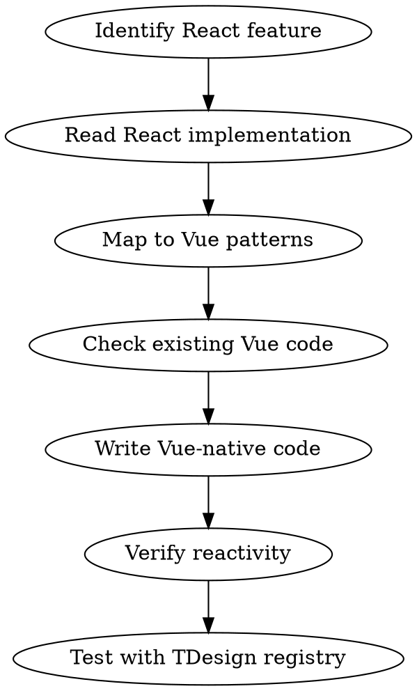

# JSON Render Vue Sync

**REQUIRED SUB-SKILL:** Use `vue` skill for all Vue 3 patterns, macros, and reactivity APIs.

## Overview

Systematically adapt features from `vercel-labs/json-render` (React) to Vue 3 while maintaining Vue idioms. **Never blindly copy React patterns** — translate them to Vue-native equivalents.

## When to Use

- Adding new features from upstream json-render
- Syncing breaking changes or API updates
- Implementing missing functionality
- Reviewing Vue implementation for React-isms

## VueUse First Principle

**优先使用 VueUse，不要重复造轮子。** 项目已依赖 `@vueuse/core`。

在实现任何功能前，先检查 VueUse 是否已有：
- 状态管理: `useStorage`, `useLocalStorage`, `useSessionStorage`
- 事件处理: `useEventListener`, `onClickOutside`, `useDebounceFn`
- 响应式工具: `watchDebounced`, `watchThrottled`, `syncRef`
- DOM 操作: `useElementSize`, `useScroll`, `useMutationObserver`
- 网络请求: `useFetch`, `useWebSocket`
- 实用工具: `get`, `set` (lodash-like path access), `isDefined`

```typescript
// ✅ 使用 VueUse
import { get, set, useDebounceFn, watchDebounced } from '@vueuse/core'

// ❌ 不要自己实现
import lodashGet from 'lodash/get'  // 已有 @vueuse/core 的 get
```

**VueUse 文档:** https://vueuse.org/functions.html

## Core Translation Patterns

| React Pattern | Vue Equivalent |
|---------------|----------------|
| `useContext` + `Provider` | `provide()` / `inject()` |
| `useState` | `ref()` / `reactive()` |
| `useMemo` | `computed()` |
| `useEffect` | `watch()` / `watchEffect()` / `onMounted` |
| `useCallback` | Direct function (Vue auto-tracks) |
| `useRef` | `ref()` for DOM, `shallowRef()` for values |
| `children` prop | `<slot>` / `useSlots()` |
| `React.forwardRef` | `defineExpose()` |
| `<Component {...props}>` | `<component :is="..." v-bind="props">` |
| JSX conditionals `{cond && <X/>}` | `v-if` / `v-show` |
| `.map()` rendering | `v-for` |
| `lodash.get/set` | `@vueuse/core` 的 `get` / `set` |
| `debounce` / `throttle` | `useDebounceFn` / `useThrottleFn` |

## Sync Workflow



### Step-by-Step

1. **Fetch upstream changes**
   ```bash
   # Clone/update vercel-labs/json-render for reference
   git clone https://github.com/vercel-labs/json-render /tmp/json-render-ref
   ```

2. **Identify changed files** — Map React files to Vue equivalents:
   - `Renderer.tsx` → `Renderer.vue`
   - `ElementRenderer.tsx` → `ElementRenderer.vue`
   - `use*.ts` hooks → `composables/use*.ts`
   - `types.ts` → `types/*.ts`

3. **Translate, don't copy**
   - Extract the LOGIC, not the syntax
   - Use Vue reactivity (`ref`, `computed`, `watch`)
   - Prefer `<script setup>` over Options API
   - Use `defineProps`, `defineEmits`, `defineModel`

4. **Verify Vue idioms**
   - Two-way binding: `v-model` + `defineModel()` or `WritableComputedRef`
   - Component lookup: `<component :is="registry[type]">`
   - Recursive render: Pass `elements` via provide/inject

## Anti-Patterns to Avoid

| React-ism | Vue Solution |
|-----------|--------------|
| Prop drilling | `provide` / `inject` |
| `useMemo` for simple values | Direct `computed()` |
| `useCallback` everywhere | Just use the function |
| `cloneElement` | Named slots or `v-bind="$attrs"` |
| `dangerouslySetInnerHTML` | `v-html` (still dangerous) |
| Controlled components pattern | `v-model` with `defineModel()` |

## Data Binding Vue Style

React json-render uses controlled components with callbacks. Vue version uses `WritableComputedRef`:

```typescript
// Vue composable - useDataBinding returns WritableComputedRef
export function useDataBinding(path: string): WritableComputedRef<unknown> {
  const data = inject(DATA_KEY)
  return computed({
    get: () => get(data.value, path),
    set: (val) => set(data.value, path, val)
  })
}

// Usage in component
const modelValue = useDataBinding(props.path)
// Works directly with v-model: <t-input v-model="modelValue" />
```

## Quick Reference

| Feature | React Location | Vue Location |
|---------|----------------|--------------|
| Entry point | `Renderer.tsx` | `components/Renderer.vue` |
| Data context | `StateProvider` | `provideData()` / `useData()` |
| Element render | `ElementRenderer` | `components/ElementRenderer.vue` |
| Actions | `useActions` hook | `composables/useActions.ts` |
| Validation | `ValidationProvider` | `composables/useValidation.ts` |
| Visibility | `useVisibility` | `composables/useVisibility.ts` |
| Streaming | `useUIStream` | `composables/useUIStream.ts` |

## Testing Strategy — 核心链路优先

**测试不是形式主义，必须覆盖核心渲染链路。**

### 必须测试的核心链路

| 链路 | 测试内容 | 文件 |
|------|----------|------|
| **Spec → 渲染** | JSON spec 能正确渲染为组件树 | `Renderer.spec.ts` |
| **数据绑定** | `useDataBinding` 读写正确，v-model 双向同步 | `useData.spec.ts` |
| **递归渲染** | 嵌套 elements 正确递归渲染 | `ElementRenderer.spec.ts` |
| **Registry 查找** | type → component 映射正确 | `registry.spec.ts` |
| **Actions 触发** | 事件 → action → 状态变更 | `useActions.spec.ts` |
| **条件可见性** | visible 条件响应式更新 | `useVisibility.spec.ts` |
| **Streaming** | JSON Patch 增量更新 UI | `useUIStream.spec.ts` |

### 测试用例编写原则

```typescript
// ❌ 形式主义测试 - 只测存在性
it('should render', () => {
  const wrapper = mount(Renderer, { props: { spec } })
  expect(wrapper.exists()).toBe(true)  // 毫无意义
})

// ✅ 核心链路测试 - 测试真实行为
it('should bind data bidirectionally', async () => {
  const spec = {
    root: 'input1',
    elements: { input1: { type: 'Input', props: { path: 'user.name' } } },
    state: { user: { name: 'initial' } }
  }
  const wrapper = mount(Renderer, { props: { spec, registry } })

  // 验证初始渲染
  expect(wrapper.find('input').element.value).toBe('initial')

  // 验证 UI → State
  await wrapper.find('input').setValue('updated')
  expect(spec.state.user.name).toBe('updated')

  // 验证 State → UI
  spec.state.user.name = 'external'
  await nextTick()
  expect(wrapper.find('input').element.value).toBe('external')
})
```

### 每次同步必须验证

1. **新功能** — 添加对应核心链路测试
2. **修改功能** — 更新现有测试，确保覆盖变更
3. **删除功能** — 清理相关测试，避免死代码

```bash
# 运行测试并检查覆盖率
pnpm test -- --coverage

# 核心文件覆盖率必须 > 80%
# composables/*.ts
# components/*.vue
```

## Checklist for Each Sync

- [ ] Read React implementation thoroughly
- [ ] Identify React-specific patterns
- [ ] Map to Vue equivalents (table above)
- [ ] Check existing Vue code for conflicts
- [ ] Write Vue-native implementation
- [ ] Verify reactivity works (no stale refs)
- [ ] **Write core path tests (not just existence checks)**
- [ ] Test with actual registry (TDesign)
- [ ] Update types if needed
- [ ] Run `pnpm typecheck` and `pnpm test`
- [ ] **Verify coverage > 80% for changed files**

## Common Mistakes

| Mistake | Fix |
|---------|-----|
| Using React callback style for events | Use `defineEmits` or direct methods |
| Manual re-render triggers | Trust Vue reactivity |
| Copying JSX ternaries as-is | Convert to `v-if` / `v-else` |
| Forgetting `shallowRef` for non-reactive values | Use `shallowRef` to avoid deep reactivity overhead |
| Not using `defineModel` for v-model | Prefer `defineModel()` over prop+emit pattern |

## Examples — 实际同步案例

### Example 1: 将 React Hook 转换为 Vue Composable

**React 原版 (useActions.ts):**
```tsx
export function useActions() {
  const [state, setState] = useState<State>()
  const actionConfig = useContext(ActionContext)

  const executeAction = useCallback(async (action: Action) => {
    if (action.confirm) {
      const confirmed = await showConfirm(action.confirm)
      if (!confirmed) return
    }
    const handler = actionConfig[action.type]
    await handler?.(action.params)
  }, [actionConfig])

  return { executeAction }
}
```

**Vue 转换 (composables/useActions.ts):**
```typescript
import { inject } from 'vue'
import { ACTION_CONFIG_KEY } from './keys'

export function useActions() {
  const actionConfig = inject(ACTION_CONFIG_KEY)

  // Vue 不需要 useCallback，直接定义函数
  async function executeAction(action: Action) {
    if (action.confirm) {
      const confirmed = await showConfirm(action.confirm)
      if (!confirmed) return
    }
    const handler = actionConfig?.[action.type]
    await handler?.(action.params)
  }

  return { executeAction }
}
```

**关键转换点：**
- `useContext` → `inject()`
- `useCallback` → 直接函数（Vue 自动追踪）
- `useState` → 如需要用 `ref()`

---

### Example 2: 将 React Provider 转换为 Vue provide/inject

**React 原版 (StateProvider.tsx):**
```tsx
const StateContext = createContext<State | null>(null)

export function StateProvider({ children, initialState }) {
  const [state, setState] = useState(initialState)

  return (
    <StateContext.Provider value={{ state, setState }}>
      {children}
    </StateContext.Provider>
  )
}

export function useStateContext() {
  return useContext(StateContext)
}
```

**Vue 转换 (composables/useData.ts):**
```typescript
import { type InjectionKey, type Ref, inject, provide, ref } from 'vue'

const DATA_KEY: InjectionKey<Ref<Record<string, unknown>>> = Symbol('data')

// Provider 端
export function provideData(initialState: Record<string, unknown>) {
  const data = ref(initialState)
  provide(DATA_KEY, data)
  return data
}

// Consumer 端
export function useData() {
  const data = inject(DATA_KEY)
  if (!data) throw new Error('useData must be used within JSONUIProvider')
  return data
}
```

**在组件中使用 (JSONUIProvider.vue):**
```vue
<script setup lang="ts">
import { provideData } from '../composables/useData'

const props = defineProps<{
  initialState: Record<string, unknown>
}>()

provideData(props.initialState)
</script>

<template>
  <slot />
</template>
```

---

### Example 3: 将 React 动态渲染转换为 Vue

**React 原版 (ElementRenderer.tsx):**
```tsx
export function ElementRenderer({ element, registry }) {
  const Component = registry[element.type]
  if (!Component) return null

  const resolvedProps = useResolvedProps(element.props)

  return (
    <Component {...resolvedProps}>
      {element.children?.map(child => (
        <ElementRenderer key={child.id} element={child} registry={registry} />
      ))}
    </Component>
  )
}
```

**Vue 转换 (components/ElementRenderer.vue):**
```vue
<script setup lang="ts">
import { computed, inject } from 'vue'
import { useResolvedProps } from '../composables/useResolvedProps'
import { REGISTRY_KEY } from '../composables/keys'

const props = defineProps<{
  element: UIElement
}>()

const registry = inject(REGISTRY_KEY)!
const Component = computed(() => registry[props.element.type])
const resolvedProps = useResolvedProps(() => props.element.props)
</script>

<template>
  <component
    v-if="Component"
    :is="Component"
    v-bind="resolvedProps"
  >
    <ElementRenderer
      v-for="child in element.children"
      :key="child.id"
      :element="child"
    />
  </component>
</template>
```

**关键转换点：**
- `registry[type]` → `computed(() => registry[type])`
- `{...props}` → `v-bind="props"`
- `.map()` → `v-for`
- `children` prop → `<slot>` 或递归组件

---

### Example 4: 数据绑定完整示例

**使用场景：** Input 组件需要双向绑定到 spec.state 中的路径

```vue
<!-- TDesign Input 包装组件 -->
<script setup lang="ts">
import { TInput } from 'tdesign-vue-next'
import { useDataBinding } from '@zwkang-dev/json-render-vue'

const props = defineProps<{
  path: string
  placeholder?: string
}>()

// useDataBinding 返回 WritableComputedRef，直接用于 v-model
const modelValue = useDataBinding(props.path)
</script>

<template>
  <TInput v-model="modelValue" :placeholder="placeholder" />
</template>
```

**测试用例：**
```typescript
import { mount } from '@vue/test-utils'
import { nextTick } from 'vue'

it('should sync input value with state path', async () => {
  const spec = {
    root: 'input1',
    elements: {
      input1: { type: 'Input', props: { path: 'form.username' } }
    },
    state: { form: { username: 'initial' } }
  }

  const wrapper = mount(Renderer, {
    props: { spec, registry: tdesignRegistry }
  })

  // 初始值正确
  expect(wrapper.find('input').element.value).toBe('initial')

  // UI → State
  await wrapper.find('input').setValue('newuser')
  expect(spec.state.form.username).toBe('newuser')

  // State → UI
  spec.state.form.username = 'external'
  await nextTick()
  expect(wrapper.find('input').element.value).toBe('external')
})
```

---
> Converted and distributed by [TomeVault](https://tomevault.io/claim/zwkang) — claim your Tome and manage your conversions.
<!-- tomevault:4.0:skill_md:2026-04-13 -->
